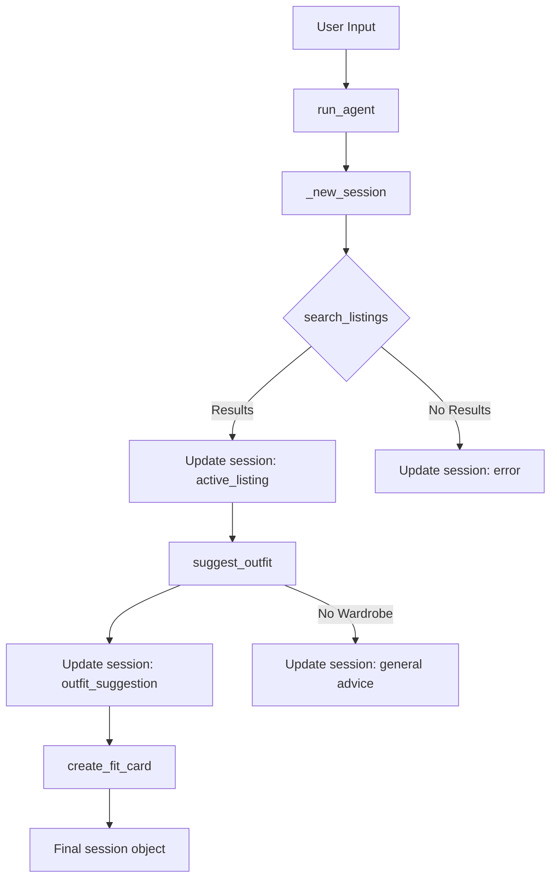

# FitFindr — planning.md

> Complete this document before writing any implementation code.
> Your spec and agent diagram are what you'll use to direct AI tools (Claude, Copilot, etc.) to generate your implementation — the more specific they are, the more useful the generated code will be.
> Your planning.md will be reviewed as part of your submission.
> Update it before starting any stretch features.

---

## Tools

List every tool your agent will use. For each tool, fill in all four fields.
You must have at least 3 tools. The three required tools are listed — add any additional tools below them.

### Tool 1: search_listings

**What it does:**
<!-- Describe what this tool does in 1–2 sentences -->
 Search the mock listings dataset for items matching the description,
    optional size, and optional price ceiling.

**Input parameters:**
<!-- List each parameter, its type, and what it represents -->
- `description` (str): Keywords describing what the user is looking for (e.g., "vintage graphic tee").
- `size` (str): Size string to filter by, or None to skip size filtering. Matching is case-insensitive (e.g., "M" matches "S/M").
- `max_price` (float): Maximum price (inclusive), or None to skip price filtering.

**What it returns:**
<!-- Describe the return value — what fields does a result contain? -->
A list of matching listing dicts, sorted by relevance (best match first). Returns an empty list if nothing matches — does NOT raise an exception.

**What happens if it fails or returns nothing:**
<!-- What should the agent do if no listings match? -->
FitFindr tells the user what to try differently and stops — it does not call suggest_outfit with empty input.
---

### Tool 2: suggest_outfit

**What it does:**
<!-- Describe what this tool does in 1–2 sentences -->
Given a thrifted item and the user's wardrobe, suggest 1–2 complete outfits.
**Input parameters:**
<!-- List each parameter, its type, and what it represents -->
- `new_item` (dict): A listing dict (the item the user is considering buying).
- `wardrobe` (dict): A wardrobe dict with an 'items' key containing a list of wardrobe item dicts. May be empty — handle this gracefully.

**What it returns:**
<!-- Describe the return value -->
 A non-empty string with outfit suggestions. 
**What happens if it fails or returns nothing:**
<!-- What should the agent do if the wardrobe is empty or no outfit can be suggested? -->
If the wardrobe is empty, offer general styling advice for the item. Rather than raising an exception or returning an empty string.
---

### Tool 3: create_fit_card

**What it does:**
<!-- Describe what this tool does in 1–2 sentences -->
Generate a short, shareable outfit caption for the thrifted find.
**Input parameters:**
<!-- List each parameter, its type, and what it represents -->
- `outfit` (str): The outfit suggestion string from suggest_outfit().
- `new_item`(dict): The listing dict for the thrifted item.
**What it returns:**
<!-- Describe the return value -->
 A 2–4 sentence string usable as an Instagram/TikTok caption. 
**What happens if it fails or returns nothing:**
<!-- What should the agent do if the outfit data is incomplete? -->
If outfit is empty or missing, return a descriptive error message. string — do NOT raise an exception.
---

### Additional Tools (if any)

<!-- Copy the block above for any tools beyond the required three -->

---

## Planning Loop

**How does your agent decide which tool to call next?**
<!-- Describe the logic your planning loop uses. What does it look at? What conditions change its behavior? How does it know when it's done? -->
Initialize the session with _new_session().
Parse the user's query to extract a description, size, and max_price.
calls search_listing with the parsed parameters.
Select the item to use (e.g., the top result).  Store it in session["selected_item"]. If results > 0, it calls suggest_outfit using the top result. If results == 0, it terminates with an apology. 
Call suggest_outfit() with the selected item and wardrobe. Store the result in session["outfit_suggestion"].
Call create_fit_card() with the outfit suggestion and selected item. Store the result in session["fit_card"].
---

## State Management

**How does information from one tool get passed to the next?**
<!-- Describe how your agent stores and accesses state within a session. What data is tracked? How is it passed between tool calls? -->

---

## Error Handling

For each tool, describe the specific failure mode you're handling and what the agent does in response.

| Tool | Failure mode | Agent response |
|------|-------------|----------------|
| search_listings | No results match the query | "No items found. Try widening your price range or search terms." |
| suggest_outfit | Wardrobe is empty | "Found [Item]! Since your closet is empty, try styling this with classic denim or black trousers." |
| create_fit_card | Outfit input is missing or incomplete | "Error: Could not generate a caption because the outfit suggestion failed."|

---

## Architecture

<!-- Draw a diagram of your agent showing how the components connect:
     User input → Planning Loop → Tools (search_listings, suggest_outfit, create_fit_card)
                                                                          ↕
                                                                   State / Session
     Show what triggers each tool, how state flows between them, and where error paths branch off.
     ASCII art, a Mermaid diagram (https://mermaid.js.org/syntax/flowchart.html), or an embedded
     sketch are all fine. You'll share this diagram with an AI tool when asking it to implement
     the planning loop and each individual tool. -->

---

## AI Tool Plan

<!-- For each part of the implementation below, describe:
     - Which AI tool you plan to use (Claude, Copilot, ChatGPT, etc.)
     - What you'll give it as input (which sections of this planning.md, your agent diagram)
     - What you expect it to produce
     - How you'll verify the output matches your spec before moving on

     "I'll use AI to help me code" is not a plan.
     "I'll give Claude my Tool 1 spec (inputs, return value, failure mode) and ask it to implement
     search_listings() using load_listings() from the data loader — then test it against 3 queries
     before trusting it" is a plan. -->

**Milestone 3 — Individual tool implementations:**

**Milestone 4 — Planning loop and state management:**

---

## A Complete Interaction (Step by Step)

Write out what a full user interaction looks like from start to finish — tool call by tool call. Use a specific example query.

**Example user query:** "I'm looking for a vintage graphic tee under $30. I mostly wear baggy jeans and chunky sneakers. What's out there and how would I style it?"

**Step 1:**
<!-- What does the agent do first? Which tool is called? With what input? -->

**Step 2:**
<!-- What happens next? What was returned from step 1? What tool is called now? -->

**Step 3:**
<!-- Continue until the full interaction is complete -->

**Final output to user:**
<!-- What does the user actually see at the end? -->
